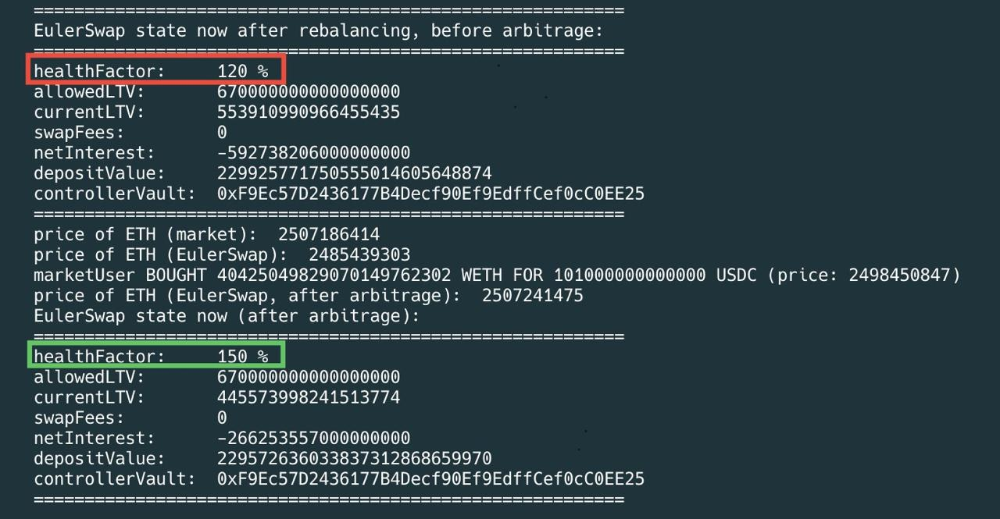

# JITpilot

JITpilot is an EulerSwap liquidity pool rebalancing system which allows users to set up automated monitoring for their EulerSwap positions, and rebalance them when needed by reparametrizing their pool and letting the market arbitrage the new state. It is a work in progress and is not ready for production use.

* Time-weighted metrics: JITpilot uses time-weighted metrics to mitigate the effects of volatile markets and prevent frequent rebalancing that could increase gas costs.
* EVC-friendly: JITpilot is designed to work with the EulerVaultConnector (EVC) to better integrate into the Euler ecosystem.
* Peace of mind: Rest easy; while your EulerSwap pool rakes in yield and fees, JITpilot will keep it healthy.

## Usage

### Installation

First [install foundry](https://getfoundry.sh/) then run:
```sh
./install.sh
```

### Run example scripts
```sh
./devland.sh JITpilotRebalanceScenario
```

If all goes well, your RPC will be available on the standard `http://127.0.0.1:8545` endpoint. It will print the logs pertaining to the EulerSwap pool rebalancing.


### Setting up an LP
```solidity
    JITpilot.configureLp(address _lp, uint256 _hfMin, uint256 _hfDesired);
```
To start monitoring your EulerSwap LP position, you need to call the `configureLp` function with the following parameters:

* `_lp`: The address of your EulerSwap LP position.
* `_hfMin`: The minimum health factor for your LP position.
* `_hfDesired`: The desired health factor for your LP position.

### Monitoring and rebalancing
```solidity
    JITpilot.updateMetrics(address _lp);
```
This function will update the metrics for the given LP. It will calculate the time-weighted average of the health factor and yield, and trigger a rebalance if needed, or trigger the EulerSwap reparametrization to the original state once the desired health factor is reached.

### Testing different scenarios
This repository is built on top of [euler-devland](https://github.com/euler-xyz/euler-devland), which is a tool for testing EulerSwap scenarios. You can find more information about it [here](https://github.com/euler-xyz/euler-devland). You can craft different scenarios where rebalancing could be needed and test them with JITpilot.

## Tests

The repository includes comprehensive unit and integration tests for the JITpilot contract using the Foundry testing framework.

### Test Files

- **`test/JITpilot.t.sol`**: Comprehensive unit tests covering all contract functions with mocked dependencies
- **`test/JITpilotIntegration.t.sol`**: Integration tests for complex scenarios involving multiple LPs and various market conditions
- **`test/JITpilotCore.t.sol`**: Core functionality tests without complex mocking, focusing on basic contract operations

### Running Tests

```bash
# Run all tests
forge test
```

### Test Coverage

The tests cover:

- **Access Control**: Owner-only functions, authorized caller management
- **Configuration**: LP setup, parameter validation, multiple LP management
- **Metrics Calculation**: Health factor and yield calculations, time-weighted averages
- **Rebalancing Logic**: Trigger conditions, status transitions, parameter calculations
- **Edge Cases**: Zero balances, missing controllers, different token decimals
- **Fuzz Testing**: Property-based testing for weight management and LP configuration